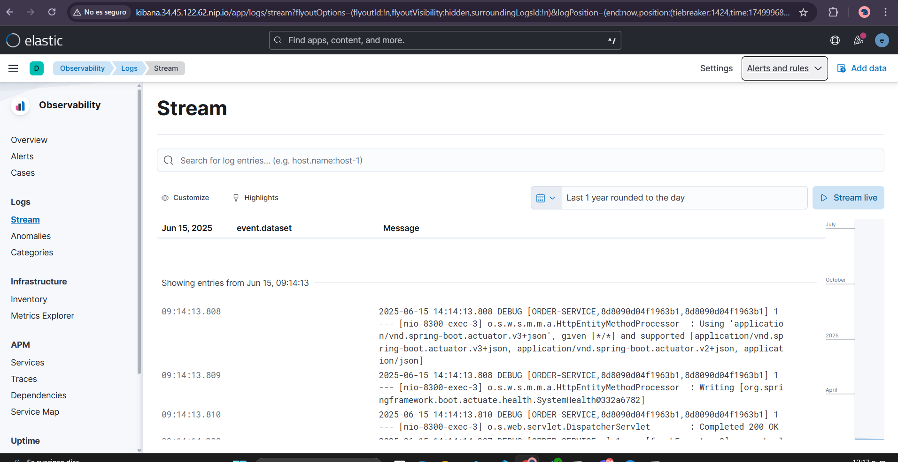
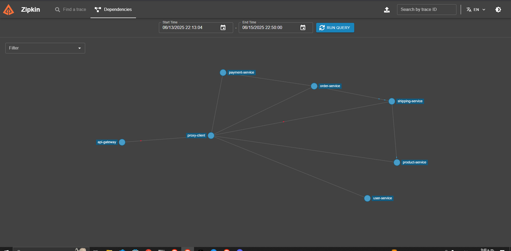
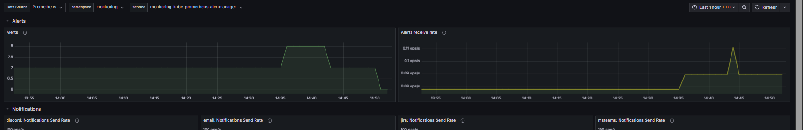
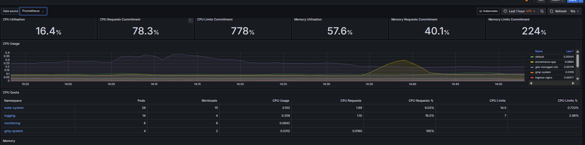
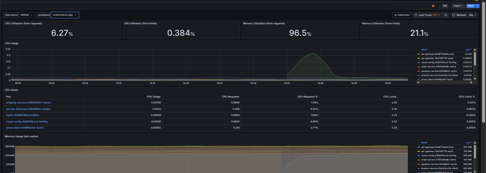
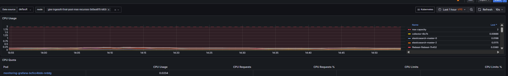
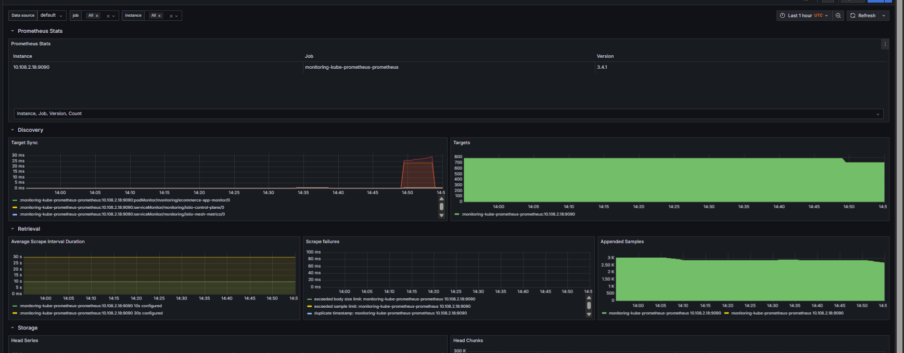
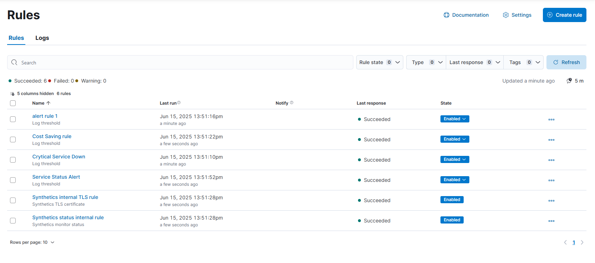
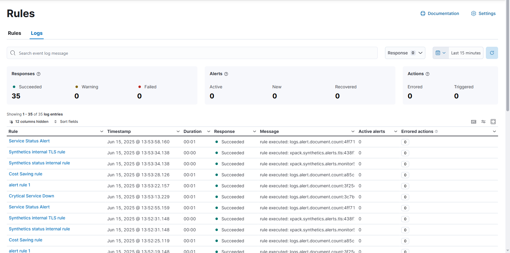

# Documentación del Proyecto

## 1. Metodología Ágil

### 📌 Descripción

Explica brevemente qué metodología ágil se está utilizando (Scrum, Kanban, SAFe, etc.), los roles principales (Scrum Master, Product Owner, equipo de desarrollo), y la frecuencia de las ceremonias.

👉 [Ver metodología completa](./METHODOLOGY.md)

---

## 2. Estrategia de Ramas (Branching Strategy)

### 📌 Descripción

Describe la estrategia utilizada: Git Flow, Trunk-Based Development, GitHub Flow, etc. Incluye el flujo de ramas (main, develop, feature, release, hotfix) y su propósito.

👉 [Ver estrategia de ramas](./BRANCHING_STRATEGY.md)

---

## 3. Sprints

### 📌 Sprint 1

* Objetivos principales
* Entregables alcanzados
* Lecciones aprendidas

# FALTA 

### 📌 Sprint 2

* Objetivos principales
* Entregables alcanzados
* Lecciones aprendidas

# FALTA 

---

## 4. Infraestructura como Código (IaC) con Terraform

### 📌 Descripción


La infraestructura despliega:
- **VPC personalizada** con configuración de red optimizada
- **Cluster GKE** con autoscaling y gestión automática
- **Múltiples ambientes** (dev, stage, prod) con configuraciones específicas


```
┌─────────────────────────────────────────┐
│              Google Cloud               │
│  ┌─────────────────────────────────────┐│
│  │            VPC Network              ││
│  │  ┌─────────────────────────────────┐││
│  │  │        GKE Subnetwork           │││
│  │  │  ┌─────────────────────────────┐│││
│  │  │  │       GKE Cluster           ││││
│  │  │  │  - Node Pool (1-5 nodes)    ││││
│  │  │  │  - Workload Identity        ││││
│  │  │  │  - Auto-scaling enabled     ││││
│  │  │  └─────────────────────────────┘│││
│  │  └─────────────────────────────────┘││
│  └─────────────────────────────────────┘│
└─────────────────────────────────────────┘
```

## 📁 Estructura del Proyecto

```
proyecto-infra/
├── main.tf                    # Configuración principal - orquesta módulos
├── variables.tf              # Variables globales del proyecto
├── providers.tf              # Configuración del provider de Google Cloud
├── backend.tf                # Estado remoto en Google Cloud Storage
├── outputs.tf                # Outputs principales del proyecto
├── terraform.tfvars          # Variables por defecto
├── versions.tf               # Versiones de Terraform y providers
│
├── environments/             # Configuraciones específicas por ambiente
│   ├── dev/
│   │   ├── backend.tf        # Backend específico para desarrollo
│   │   └── terraform.tfvars  # Variables para ambiente de desarrollo
│   ├── stage/
│   │   ├── backend.tf        # Backend específico para staging
│   │   └── terraform.tfvars  # Variables para ambiente de staging
│   └── prod/
│       ├── backend.tf        # Backend específico para producción
│       └── terraform.tfvars  # Variables para ambiente de producción
│
└── modules/                  # Módulos reutilizables
    ├── vpc/                  # Módulo de red VPC
    │   ├── main.tf           # Recursos de red (VPC + Subnetwork)
    │   ├── variables.tf      # Variables del módulo VPC
    │   └── outputs.tf        # Outputs del módulo VPC
    └── gke/                  # Módulo de Kubernetes
        ├── main.tf           # Recursos GKE (Cluster + Node Pool)
        ├── variables.tf      # Variables del módulo GKE
        └── outputs.tf        # Outputs del módulo GKE
```


## 🧩 Módulos Reutilizables

### Módulo VPC (`modules/vpc/`)

Gestiona la configuración de red en Google Cloud:

**Recursos creados:**
- `google_compute_network`: Red VPC principal sin subredes automáticas
- `google_compute_subnetwork`: Subred dedicada para GKE con acceso privado a Google

**Variables principales:**
- `project_id`: ID del proyecto en GCP
- `network_name`: Nombre de la red VPC (default: `ingesoft-vpc`)
- `subnetwork_ip_cidr_range`: Rango CIDR (default: `10.10.0.0/20`)

### Módulo GKE (`modules/gke/`)


Despliega y configura el cluster de Kubernetes:

**Recursos creados:**
- `google_container_cluster`: Cluster principal con configuración optimizada
- `google_container_node_pool`: Pool de nodos con autoscaling


**Características configuradas:**
- ✅ Workload Identity para seguridad mejorada
- ✅ Logging y monitoring nativos de Kubernetes
- ✅ Autoscaling automático de nodos
- ✅ Auto-repair y auto-upgrade habilitados
- ✅ Canal de versiones REGULAR para estabilidad

## 🌍 Configuración por Ambientes

| Ambiente | Nodos Iniciales | Nodos Mínimos | Nodos Máximos | Uso |
|----------|----------------|---------------|---------------|-----|
| **dev**  | 1              | 1             | 2             | Desarrollo y pruebas |
| **stage**| 2              | 1             | 3             | Staging y QA |
| **prod** | 3              | 3             | 5             | Producción |

## 🚀 Uso

### Requisitos Previos

1. **Terraform** >= 1.0
2. **Google Cloud SDK** configurado
3. **Proyecto GCP** con APIs habilitadas:
   - Compute Engine API
   - Kubernetes Engine API
   - Cloud Resource Manager API

### Configuración Inicial

1. **Autenticación con Google Cloud:**
   ```bash
   gcloud auth application-default login
   gcloud config set project YOUR_PROJECT_ID
   ```

2. **Inicializar Terraform:**
   ```bash
   terraform init
   ```

### Despliegue por Ambiente

#### Desarrollo
```bash
cd environments/dev
terraform init
terraform plan
terraform apply
```

#### Staging
```bash
cd environments/stage
terraform init
terraform plan
terraform apply
```

#### Producción
```bash
cd environments/prod
terraform init
terraform plan
terraform apply
```

### Comandos Útiles

```bash
# Ver estado actual
terraform show

# Formatear código
terraform fmt

# Validar configuración
terraform validate

# Ver outputs
terraform output

# Destruir infraestructura (¡Cuidado en producción!)
terraform destroy
```

## 🔧 Variables Principales

| Variable | Descripción | Default | Ambiente |
|----------|-------------|---------|----------|
| `project_id` | ID del proyecto GCP | - | Requerido |
| `region` | Región principal | `us-central1` | Configurable |
| `cluster_name` | Nombre del cluster | `ingesoft-final` | Configurable |
| `gke_node_machine_type` | Tipo de máquina | `e2-standard-2` | Configurable |
| `vpc_network_name` | Nombre de la VPC | `ingesoft-vpc` | Configurable |

## 🏆 Buenas Prácticas Implementadas

### ✅ Organización
- **Separación por ambientes** con configuraciones independientes
- **Modularización** para reutilización y mantenimiento
- **Documentación** completa de variables y outputs

### ✅ Seguridad
- **Outputs sensibles** marcados apropiadamente
- **OAuth scopes mínimos** necesarios
- **Workload Identity** configurado
- **Private Google Access** habilitado

### ✅ Operaciones
- **Estado remoto** en Google Cloud Storage
- **Autoscaling** configurado por ambiente
- **Auto-repair/upgrade** para nodos
- **Logging y monitoring** integrados

### ✅ Código
- **Variables tipadas** con descripciones
- **Outputs estructurados** y documentados
- **Convenciones de nombres** consistentes

## 🔍 Outputs Disponibles

Después del despliegue, los siguientes outputs estarán disponibles:

```bash
terraform output cluster_name           # Nombre del cluster
terraform output cluster_endpoint       # Endpoint del cluster (sensible)
terraform output network_name          # Nombre de la VPC
terraform output workload_identity_pool # Pool de Workload Identity
```

## 🐛 Troubleshooting

### Error: "Backend configuration changed"
```bash
terraform init -reconfigure
```

### Error: "APIs not enabled"
```bash
gcloud services enable compute.googleapis.com
gcloud services enable container.googleapis.com
```

### Error: "Insufficient permissions"
Verificar que el service account tenga los roles:
- Compute Admin
- Kubernetes Engine Admin
- Service Account User

## 📝 Notas Técnicas

- **MTU**: Configurado a 1460 para optimización de red
- **CIDR**: Rango `10.10.0.0/20` proporciona ~4000 IPs
- **Machine Type**: `e2-standard-2` balancea costo y rendimiento
- **Disk**: 50GB SSD por nodo (comentado en configuración actual)


# FALTA 

---

## 5. Patrones de Diseño

### 📌 Descripción General
Los patrones de diseño son soluciones reutilizables a problemas comunes en el desarrollo de software. En arquitecturas de microservicios, estos patrones son fundamentales para garantizar la escalabilidad, mantenibilidad y resiliencia del sistema.

## ✅ Patrones Implementados

### Resiliencia

La arquitectura implementada incorpora varios patrones críticos para garantizar la resiliencia y estabilidad del sistema:
### Circuit Breaker Pattern

Propósito: Previene cascadas de fallos entre servicios mediante la implementación de un "interruptor" que se activa cuando se detectan errores consecutivos
Implementación: Cada microservicio incluye mecanismos de circuit breaker que monitorean las llamadas a servicios externos
Beneficios: Reduce la latencia de respuesta durante fallos y permite que el sistema se recupere gradualmente
Estados: Cerrado (funcionamiento normal), Abierto (bloqueando llamadas), Medio-abierto (probando recuperación)

### Bulkhead Pattern

Propósito: Aislamiento de recursos para prevenir que el fallo de un componente afecte a otros
Implementación: Separación de pools de conexiones, threads y recursos de memoria entre diferentes servicios
Beneficios: Garantiza que un servicio sobrecargado no comprometa la disponibilidad de otros componentes
Aplicación: Implementado a nivel de contenedores en Kubernetes con límites de recursos definidos


#### Configuración

* **External Configuration**: Implementado en Kubernetes y aplicado también a `favourite-service` sin necesidad de modificar código fuente.

> **Ejemplo de External Configuration en Java:**

```java
public static final String USER_SERVICE_HOST = "http://USER-SERVICE/user-service";
```

#### Otros posibles patrones

* Service Discovery
* API Gateway
* Adapter Pattern
* Strategy Pattern
---

## 6. CI/CD Avanzado

### 📌 Descripción

* Herramientas utilizadas (GitHub Actions, GitLab CI, Jenkins, etc.)
* Pipelines para cada tipo de entorno (dev, staging, prod)
* Integración con testing y despliegues automáticos
* Validaciones previas (lint, scan, test)

# FALTA 

---

## 7. Pruebas del Proyecto

### 📌 Tipos de pruebas

* ✅ **Unitarias**: Detallar qué servicios fueron cubiertos y qué frameworks se usaron (JUnit, Mockito, etc.)
* ✅ **Integración**: Mencionar qué módulos interactúan y cómo se testea
* ✅ **E2E**: Describir herramientas (como Cypress, Selenium) y cobertura
* ✅ **Performance con Locust**: Explicar casos de prueba y métricas

PARA ESTAS PRUEBAS QUE YA FUERON IMPLEMENTADAS Y PROBADAS ANTERIORMENTE POR FAVOR MIRAR EL DOCUMENTO [Ver estrategia de ramas](./README-PROJECT-DOCUMENTACION.md)]


* ❌ **Seguridad (OWASP)**: **No implementadas aún**, dejar como pendiente o en backlog

# FALTA 

### 📊 Informes de Cobertura

* Herramientas utilizadas (JaCoCo, SonarQube, etc.)
* Porcentaje de cobertura general y por módulo

# FALTA 

---

## 8. Release notes

# 
!  [Zipkin Dashboard](image-12.png)


---

## 9. Observabilidad y Monitoreo

### 📌 Stack de Observabilidad

#### Prometheus y Grafana

* Integración con servicios
* Dashboards por servicio
* Métricas recolectadas

# FALTA 

# ELK Stack 

## Descripción General

El ELK Stack (Elasticsearch, Logstash, Kibana) junto con Filebeat proporciona una solución completa de logging y análisis de datos. Esta configuración se despliega automáticamente en Kubernetes usando Helm charts dentro del pipeline de infraestructura.

## Arquitectura de Componentes

### 🔍 **Elasticsearch**
- **Función**: Motor de búsqueda y análisis distribuido
- **Propósito**: Almacena y indexa los logs para búsquedas rápidas
- **Configuración**: `elasticsearch-values.yaml`

### 📊 **Logstash** 
- **Función**: Procesador de datos en tiempo real
- **Propósito**: Recibe, transforma y envía logs a Elasticsearch
- **Configuración**: `logstash-values.yaml`

### 📈 **Kibana**
- **Función**: Interfaz de visualización y análisis
- **Propósito**: Dashboard para explorar y visualizar datos de Elasticsearch
- **Configuración**: `kibana-values.yaml`

### 🚀 **Filebeat**
- **Función**: Agente de recolección de logs ligero
- **Propósito**: Recolecta logs de contenedores y los envía a Logstash
- **Configuración**: `filebeat-values.yaml`

## Pipeline de Despliegue

### Stage de Despliegue ELK

```groovy
stage('Deploy ELK Stack') {
    when { branch 'master' }
    steps {
        bat '''
            echo "📊 Deploying ELK Stack (Elasticsearch, Logstash, Kibana) and Filebeat..."

            // Agregar repositorio oficial de Elastic
            helm repo add elastic https://helm.elastic.co
            helm repo update

            // Desplegar Elasticsearch
            echo "📦 Deploying Elasticsearch..."
            helm upgrade --install elasticsearch elastic/elasticsearch ^
            --namespace logging --create-namespace ^
            -f modules/monitoring/elasticsearch-values.yaml

            // Esperar que Elasticsearch esté listo
            echo "⏳ Waiting for Elasticsearch to be ready..."
            kubectl wait --for=condition=Ready pod -l app=elasticsearch-master ^
            --namespace logging --timeout=600s

            // Desplegar Logstash
            echo "📦 Deploying Logstash..."
            helm upgrade --install logstash elastic/logstash ^
            --namespace logging ^
            -f modules/monitoring/logstash-values.yaml

            // Desplegar Kibana
            echo "📦 Deploying Kibana..."
            helm upgrade --install kibana elastic/kibana ^
            --namespace logging ^
            -f modules/monitoring/kibana-values.yaml

            // Desplegar Filebeat
            echo "📦 Deploying Filebeat..."
            helm upgrade --install filebeat elastic/filebeat ^
            --namespace logging ^
            -f modules/monitoring/filebeat-values.yaml

            echo "✅ ELK Stack and Filebeat deployed successfully!"
        '''
    }
}
```

### Características Clave del Pipeline

- **Ejecución Condicional**: Solo se ejecuta en la rama `master`
- **Gestión de Dependencias**: Agrega y actualiza el repositorio de Helm de Elastic
- **Despliegue Secuencial**: Elasticsearch → Logstash → Kibana → Filebeat
- **Verificación de Estado**: Espera confirmación de que Elasticsearch esté operativo
- **Namespace Dedicado**: Todos los componentes se despliegan en el namespace `logging`

## Archivos de Configuración

### 1. `elasticsearch-values.yaml`
**Propósito**: Configuración de recursos y afinidad para Elasticsearch
```yaml
# Ejemplo de configuración
resources:
  requests:
    cpu: "100m"
    memory: "512Mi"
  limits:
    cpu: "1000m"
    memory: "2Gi"
```

### 2. `kibana-values.yaml`
**Propósito**: Configuración de servicio y recursos para Kibana
```yaml
# Ejemplo de configuración
service:
  type: NodePort
  port: 5601
resources:
  requests:
    cpu: "100m"
    memory: "256Mi"
```

### 3. `logstash-values.yaml`
**Propósito**: Configuración de pipeline de procesamiento y conexión con Elasticsearch
- Define variables de entorno y credenciales
- Configura pipeline de procesamiento de logs
- Gestiona certificados de seguridad
- Especifica puertos y recursos

### 4. `filebeat-values.yaml`
**Propósito**: Configuración de recolección de logs desde contenedores
- Define rutas de logs de contenedores
- Configura procesadores para metadata de Kubernetes
- Establece conexión con Logstash como salida

### 5. `values.yaml`
**Propósito**: Configuración del stack de monitoreo completo (Prometheus, Grafana, Alertmanager)
- Configura recursos y almacenamiento
- Define reglas de alertas y notificaciones
- Establece dashboards y ServiceMonitors

## Flujo de Datos

```
[Contenedores] → [Filebeat] → [Logstash] → [Elasticsearch] → [Kibana]
```

1. **Filebeat** recolecta logs de contenedores en tiempo real
2. **Logstash** procesa, transforma y enriquece los logs
3. **Elasticsearch** indexa y almacena los logs procesados
4. **Kibana** proporciona visualización y análisis de los datos

## Ventajas y Consideraciones

### ✅ **Beneficios Clave**
- **Automatización**: Despliegue integrado en pipeline CI/CD
- **Escalabilidad**: Preparado para producción con configuración flexible
- **Observabilidad**: Monitoreo completo de logs y métricas con gestión de seguridad

### ⚠️ **Consideraciones Importantes**
- **Recursos**: Elasticsearch requiere CPU/memoria significativa y almacenamiento persistente
- **Seguridad**: Configurar autenticación, cifrado y estrategias de backup
- **Monitoreo**: Supervisar rendimiento y salud del cluster

### 🔗 **Acceso Post-Despliegue**
**Kibana** (dashboards) | **Elasticsearch** (API REST) | **Logs** (agregación automática)

Esta configuración integra observabilidad completa en Kubernetes con despliegue automatizado.


# Dashboards Fundamentales para Monitoreo y Observabilidad

## 📊 Categorización por Función

### 🔍 **Trazabilidad y Debugging**
#### Ziplin - Trazabilidad Distribuida


**Propósito Principal:**
Visualiza el flujo de requests a través de tu arquitectura de microservicios, mostrando las conexiones y dependencias entre servicios.

**Por qué es crítico:**
- **Identificación de cuellos de botella:** Detecta qué servicios introducen latencia en el flujo de requests
- **Análisis de dependencias:** Comprende cómo los servicios interactúan entre sí
- **Troubleshooting de errores:** Localiza rápidamente dónde fallan las transacciones distribuidas
- **Optimización de rendimiento:** Identifica oportunidades para mejorar la arquitectura

---

### 🚨 **Gestión de Alertas**
#### Grafana - Alertmanager / Overview


**Por qué es crítico:**
Es tu centro de comando centralizado que consolida alertas de múltiples fuentes (Prometheus, aplicaciones, infraestructura) y te permite gestionar el estado completo: activas, silenciadas y resueltas. Sin este dashboard podrías perderte alertas críticas que requieren acción inmediata, comprometiendo SLAs y tiempos de respuesta a incidentes.

---

### 🏗️ **Monitoreo de Infraestructura Kubernetes**

#### Kubernetes / Compute Resources / Cluster


**Por qué es vital:**
Proporciona una vista panorámica del consumo de CPU, memoria y almacenamiento de todo el clúster, detectando problemas de capacidad antes de que impacten usuarios. Identifica patrones de uso para planificación de recursos, previene caídas por saturación y optimiza costos mostrando recursos subutilizados.

#### Kubernetes / Compute Resources / Namespace (Pods)


**Por qué es esencial:**
Ofrece granularidad por aplicación para saber exactamente qué consume cada servicio, identifica aplicaciones problemáticas con consumo excesivo y facilita troubleshooting de rendimiento. Permite chargeback y asignación de costos por equipo/proyecto, además de detectar memory leaks y procesos descontrolados.

#### Kubernetes / Compute Resources / Node (Pods)


**Por qué es fundamental:**
Monitorea la salud individual de cada servidor del clúster, detectando nodos sobrecargados antes de fallos y identificando problemas de hardware o configuración. Permite balanceo proactivo de cargas y es esencial para mantenimiento preventivo eficaz.

---

### 🔧 **Monitoreo del Sistema de Monitoreo**
#### Prometheus / Overview


**Por qué es indispensable:**
Monitorea al monitor mismo, asegurando que tu sistema de observabilidad funcione correctamente. Detecta problemas en recolección de métricas, verifica evaluación correcta de reglas de alertas e identifica cuellos de botella en el propio sistema de monitoreo. Sin métricas confiables, todas las decisiones operativas se vuelven ciegas.

---

## 🎯 Flujo de Trabajo Recomendado

### 1. **Verificación Diaria**
- **Alertmanager Overview:** Revisar estado de alertas activas
- **Prometheus Overview:** Confirmar que el sistema de monitoreo funciona correctamente

### 2. **Análisis de Capacidad**
- **Kubernetes Cluster:** Vista general de recursos del clúster
- **Kubernetes Namespace:** Identificar aplicaciones con alto consumo
- **Kubernetes Node:** Detectar nodos con problemas

### 3. **Investigación de Problemas**
- **Zipkin:** Análisis detallado de transacciones distribuidas
- **Kubernetes dashboards específicos:** Drill-down en recursos problemáticos

---

## 🏆 Prioridades de Monitoreo

### **Crítico (Revisar múltiples veces al día)**
1. Alertmanager Overview
2. Prometheus Overview

### **Importante (Revisar diariamente)**
3. Kubernetes Cluster Resources
4. Kubernetes Node Resources

### **Necesario (Revisar según demanda)**
5. Kubernetes Namespace Resources
6. Zipkin Tracing

---

## 📈 Métricas Clave por Dashboard

### **Alertmanager**
- Alertas activas por severidad
- Tiempo de resolución promedio
- Alertas silenciadas

### **Kubernetes Cluster**
- CPU/Memory utilization %
- Storage utilization
- Pod count trends

### **Kubernetes Namespace**
- Resource requests vs limits
- Resource utilization por aplicación
- Pod restart frequency

### **Kubernetes Node**
- Node health status
- Resource pressure indicators
- Network and disk I/O

### **Prometheus**
- Scrape success rate
- Query performance
- Storage retention

### **Zipkin**
- Request latency percentiles
- Error rate by service
- Service dependency map`


#### Alertas

## Configuración de Alertas en ELK Stack

El sistema de alertas está configurado en Kibana para monitorear patrones específicos en los logs y métricas recolectadas. Las alertas se activan cuando se cumplen ciertas condiciones predefinidas, permitiendo una respuesta rápida a incidentes.

### Tipos de Alertas Configuradas

- **Alertas de Error**: Se activan cuando aparecen errores críticos en los logs de aplicaciones
- **Alertas de Latencia**: Monitorean cuando los tiempos de respuesta superan umbrales predefinidos
- **Alertas de Disponibilidad**: Detectan cuando un servicio deja de responder
- **Alertas de Seguridad**: Identifican patrones sospechosos en los logs (intentos de acceso fallidos múltiples)

### Configuración de Reglas en Kibana

Como se muestra en la imagen, las reglas de alerta en Kibana están configuradas con:

1. **Condiciones de activación**: Expresiones que definen cuándo se dispara una alerta
2. **Período de evaluación**: Frecuencia con la que se evalúan las condiciones
3. **Acciones**: Respuestas automatizadas cuando se activa una alerta (notificaciones)
4. **Silenciamiento**: Períodos programados donde no se envían notificaciones

### Integración con Canales de Notificación

Las alertas están integradas con múltiples canales para asegurar que el equipo adecuado reciba las notificaciones:

- Slack (alertas de prioridad alta)
- Email (resúmenes diarios y alertas de prioridad media)
- Webhook para integración con sistemas de tickets
- PagerDuty para incidentes críticos fuera de horario laboral

* Reglas configuradas
* Notificaciones por canal (Slack, email, etc.)


# FALTA 

#### Métricas de negocio


# FALTA 

---
